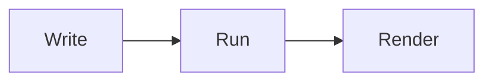

# ClrKernel executable markdown

This file is a notebook in VS Code (via the ClrKernel Notebooks extension) and
a plain markdown document everywhere else. The same file can be imported into
any ClrKernel session with `#!import "hello.nb.md"` — the csharp blocks run,
the prose doesn't.

```csharp
var greeting = "Hello from ClrKernel";
Console.WriteLine(greeting);
```

State persists between cells, exactly like a Jupyter session:

```csharp
Console.WriteLine(greeting.ToUpper() + "!");
```

NuGet references work too:

```csharp
#r "nuget: Humanizer"
using Humanizer;
Console.WriteLine(TimeSpan.FromDays(45).Humanize());
```

```csharp
#r "nuget: YamlDotNet, 16.3.0"
using YamlDotNet.Serialization;
Console.WriteLine("YamlDotNet loaded");
var yaml = @"name: ClrKernel
version: 0.6.0
tags:
  - jupyter
  - dotnet";
var deserializer = new DeserializerBuilder().Build();
var doc = deserializer.Deserialize<Dictionary<string, object>>(yaml);
Console.WriteLine($"parsed {doc["name"]} v{doc["version"]} with {((List<object>)doc["tags"]).Count} tags");
```

## HTTP requests

Set a cell's language to **HTTP** to make requests in the VS Code REST Client
`.http` syntax. Each request renders a rich response card.

```http
GET https://httpbin.org/json
Accept: application/json
```

## Mermaid diagrams

Set a cell's language to **Mermaid** to render diagrams (fully offline).



## PowerShell

Set a cell's language to **PowerShell** to run it in a persistent runspace.

```powershell
$greeting = 'Hello from PowerShell'
Get-Date | Select-Object DayOfWeek, Year
$greeting
```
