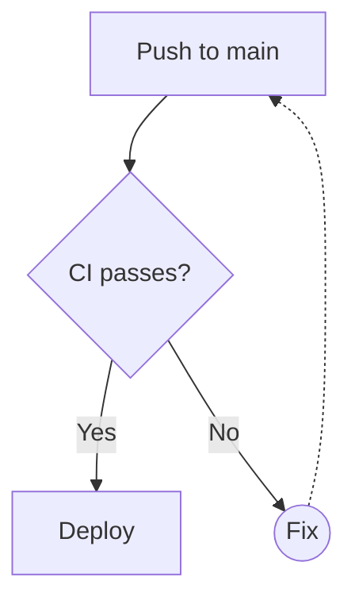
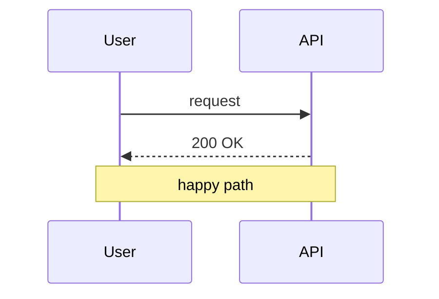

# Mermaid diagrams in ClrKernel

ClrKernel renders **Mermaid diagram cells**. In a notebook, set a cell's language
to **Mermaid** (or start it with the `#!mermaid` selector); in a plain `.nb.md`
file, use a ` ```mermaid ` fenced block like the ones below. Diagrams render
**fully offline** — the Mermaid library is embedded, so nothing is fetched over
the network — and follow the editor's light/dark theme.

## Flowchart



## Sequence diagram



## From C# code

Diagrams can also be produced programmatically and shown with the
`DisplayMermaid()` helper — handy for generating a diagram from data.

```csharp
var nodes = new[] { "Ingest", "Transform", "Load" };
var diagram = "graph LR\n" +
    string.Join("\n", nodes.Zip(nodes.Skip(1), (a, b) => $"  {a} --> {b}"));
diagram.DisplayMermaid();
```
